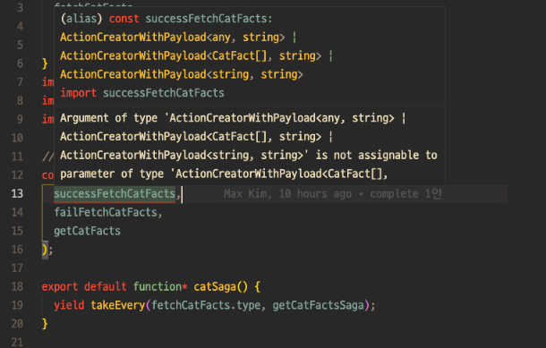

# Minimize Redux+Saga Typing

- Redux+Saga의 타이핑을 여러 도구를 이용해 줄여봅니다.
- 사용 도구 : Redux Toolkit, 자체 utils

## Motivation

- [이 글](https://maxkim-j.github.io/posts/how-to-use-redux-saga)에서 Redux+Saga가 러닝 커브가 높은 편이고, 타이핑이 너무 많다고 불평(?)한 바 있습니다.
- 실제로 Saga를 도입해서 프로젝트를 했을 때, 반복되는 타이핑에 지쳐 컴포넌트 단에 Saga를 사용하다 말고 async/await 를 사용해 컴포넌트 단에서 API를 패치했던 적도 있습니다. 비즈니스 로직과 UI로직이 섞이고, 프로덕트의 일관성 있는 컨벤션을 침해하는 좋지 않은 방법인데도 말입니다.
- Redux Toolkit의 createSlice를 사용하면 리덕스+사가의 타이핑을 많이 줄일 수 있습니다. 하지만 혹시 자체 유틸 함수를 이용해 '더' 줄일 수 있는지 타진합니다.

## Requirements

다음과 같은 요구사항을 만족해야 합니다.

1. 타입 오류가 발생하지 않아야 합니다(TypeScript를 사용합니다)
2. 추론이 잘 되서 오류 없이 돌아가더라도, 개발자들의 원할한 협업을 위해 타입을 노출시키는게 좋다고 판단 될 경우 명시적으로 타입을 작성합니다.
3. 맹목적으로 타이핑을 줄이는 것만이 목적이 되어서는 안 됩니다. **타이핑을 해야 좋은 부분**도 명백히 존재함을 인지하고 팀의 생산성과 프로덕트의 유지보수에 기여할 수 있는 방향으로 생각하려 노력합니다.
4. 프로젝트에 실제로 적용될 수 있음을 인지하며, **쓸만한 practice**를 만듭니다.

## AsyncEntity 타입 + initialState

createSlice를 사용하면 초기 state를 선언할때도 타입 지정이 딱히 필요 없다. 바로 객체에다가 초기 상태값을 적어주면 되기 때문이다. 아래는 [redux-toolkit docs의 createSlice example](https://redux-toolkit.js.org/api/createSlice#examples)

```ts
const user = createSlice({
  name: 'user',
  initialState: { name: '', age: 20 },
  reducers: {
    setUserName: (state, action) => {
      state.name = action.payload
    },
  },
}
```

하지만 state의 초기값에 명시적으로 타입을 지정하면 개발 과정에서 store의 초기 상태를 파악하기 더 편하다. 따라서 이런 식으로 명시적인 타입 지정을 했다.

```ts
interface CatState {
  catFact: AsyncEntity<CatFact[], string>;
}

const initialState: CatState = {
  catFact: {
    data: null,
    status: "idle",
    error: null
  }
};

export const catSlice = createSlice({
  name: "cats",
  initialState,
  reducers: {
    ...
  }
});
```

여기서 AsyncEntity라는 미리 정의한 타입을 제네릭과 함께 사용했다. AsyncAction에 필요한 프로퍼티라고 할 수 있는 status, data, error을 포함한다. 제네릭으로 성공시 data의 타입과 실패시 error의 타입을 지정해줄 수 있다.

```ts
export type AsyncEntity<T, R> = {
  data: T | null; // 데이터 없는 경우에는 명시적으로 null
  status: "idle" | "loading" | "success" | "fail"; // 초기|로딩|성공|실패
  error: R | null;
};
```

AsyncEntity는 용례에 따라 다양한 모습이 될 수 있다. 가령 http method에 따라 프로퍼티를 다르게 할 수도 있고, 백엔드의 상태나 개발 진척도에 따라 다른 프로퍼티를 가지게 할 수도 있다. 다양한 AsyncEntity를 만들고 상황에 맞는 AsyncEntity룰 돌려가며 쓸 수도 있다.

## createAsyncReducers로 reducer 함수들 한번에 리턴하기

하나의 API 요청에 대하여 start, success, fail 동작에 해당하는 3개의 reducer 함수로 이루어진 객체를 한꺼번에 만드는 함수를 작성한다.

`createAsyncReducers`는 고차함수인데, 그 이유가 reducers 객체의 함수는 딱히 함수에 제네릭을 선언하지 않아도 첫번째 제네릭 타입으로 `WritableDraft<특정State>`를 받기 때문이다.

그런데 redux toolkit이 WritableDraft를 import로 제공하지 않기 때문에 첫번째 단계의 함수에서는 WritableDraft를, 두번째 단계의 함수에서는 reducer와 action을 만드는데 필요한 타입, start/success/fail을 받는다.

```ts
interface CreateAsyncReducersParams {
  name: string;
  entity: string;
  cleanDataWhenStart?: boolean; // fetch가 시작되기 전 data 초기화
}

const capitalize = (str: string) => {
  return str[0].toUpperCase() + str.slice(1);
};

const createAsyncReducers = <State extends { [key: string]: any }>({
  name,
  entity,
  cleanDataWhenStart = false
}: CreateAsyncReducersParams) => <Start, Success, Fail>() => {
  const result: {
    [key: string]:
      | ((state: State, action: PayloadAction<Start>) => void)
      | ((state: State, action: PayloadAction<Success>) => void)
      | ((state: State, action: PayloadAction<Fail>) => void);
  } = {
    [`${name}`]: (state: State, action: PayloadAction<Start>) => {
      if (cleanDataWhenStart) {
        (state[entity] as AsyncEntity<Success, Fail>).data = null;
      }
      (state[entity] as AsyncEntity<Success, Fail>).status = "loading";
    },
    [`success${capitalize(name)}`]: (
      state: State,
      action: PayloadAction<Success>
    ) => {
      (state[entity] as AsyncEntity<Success, Fail>).data = action.payload;
      (state[entity] as AsyncEntity<Success, Fail>).status = "success";
    },
    [`fail${capitalize(name)}`]: (
      state: State,
      action: PayloadAction<Fail>
    ) => {
      (state[entity] as AsyncEntity<Success, Fail>).error = action.payload;
      (state[entity] as AsyncEntity<Success, Fail>).status = "fail";
    }
  };
  return result;
};
```

전개 연산자로 reducers에 함수 호출하여 뿌려준다.

```ts
import { createSlice } from "@reduxjs/toolkit";
import { CatState, CatFact } from "./types";
import { createAsyncReducers } from "../utils";

const initialState: CatState = {
  catFact: {
    data: null,
    status: "idle",
    error: null
  }
};

export const catSlice = createSlice({
  name: "cats",
  initialState,
  reducers: {
    ...createAsyncReducers({
      name: "fetchCatFacts",
      entity: "catFact"
    })<any, CatFact[], string>()
  }
});

export const {
  fetchCatFacts,
  successFetchCatFacts,
  failFetchCatFacts
} = catSlice.actions;

export default catSlice.reducer;

// 컴포넌트 - 기본적으로 action.payload를 다 가지고 있는 함수 시그니처를 가지고 리턴하기 때문에 reducer에서 활용하는 action.payload가 따로 없더라도 빈 객체를 넣어준다.
dispatch(fetchCatFacts({}));
```

약간 [typesafe-actions](https://github.com/piotrwitek/typesafe-actions)의 `createAsyncAction`과 비슷한 꼴이 되었다. typesafe-actions도 request, success, failure 액션 페이로드의 타입을 제네릭으로 넘겨서 비동기 액션에 필요한 액션 객체 리턴 함수 여러개를 한꺼번에 만들 수 있게 한다.

```ts
createAsyncAction(
  requestType, successType, failureType, cancelType?
)<TRequestPayload, TSuccessPayload, TFailurePayload, TCancelPayload?>()
```

다른 점으로 `createAsyncAction`은 액션 객체를 리턴하는 함수들을 만들고, `createAsyncReducers`는 createSlice의 reducer 함수들을 만든다.

`createAsyncAction`의 리턴값은 객체로 success, failure 프로퍼티로 해당 액션 객체 리턴하는 함수에 접근이 가능하고, 컴포넌트의 dispatch나 saga에서 put을 그 함수로 한다.

```ts
const getCats = createAsyncAction(GET_CATS, GET_CATS_SUCCESS, GET_CATS_FAILURE)<
  { id: number },
  Cat[],
  AxiosError
>();

// component
dispatch(getCats.request({ id: 1 }));

// saga
yield put(getCats.success(cat));
```

하지만 slice의 reducers는 네스팅을 허용하지 않는다. 즉 이렇게 만들수 없음.

```ts
// 컴포넌트에서 이렇게 하려고
dispatch(fecthCatFacts.request());

// 이렇게 하면 error가 난다

reducers: {
  fetchCatFacts: {
    request: (state, action) => {};
    success: (state, action) => {};
    failure: (state, action) => {};
  }
}
```

reducer 함수들은 reducers 객체 내부의 최상위에 존재해야 한다. 그래서 위의 `createAsyncReducers` 사용례에서도 전개 연산자를 쓴 것이다.

slice를 사용할때 reducers 함수를 통해 action과 reducer를 모두 다 만들어야 한다. 추측해보면 저런 식으로 네스팅하여 함수를 배치할 수 있다면 모든 깊이의 함수들을 모아서 액션, 리듀서를 만들어내기 위한 로직은 꽤 복잡할 것이다. 그렇기 때문에 최상위에 함수가 아닌 다른게 있으면 에러를 뿜도록 규칙을 정한것이 아닌가 생각된다.

## CreateSaga

[Saga Entity Pattern](https://github.com/redux-saga/redux-saga/blob/master/examples/real-world/sagas/index.js)을 사용하여 Saga 내부에서의 동작을 반복해서 사가마다 작성할 필요가 없도록 만들 수 있다.

typesafe-action을 이용하거나 [한재엽님이 작성한 createFetchAction 함수](https://jbee.io/react/react-2-redux-architecture/#%EC%9E%90%EC%B2%B4-util-%EC%A0%9C%EC%9E%91---redux-saga-util)를 사용하면 하나의 비동기 로직에 대한 여러개의 액션 함수를 한 객체에 깔끔하게 정리할 수 있어 Saga를 만들기도 편하다. 이런식으로 하면 되기 때문에.. 아래는 [한재엽님이 작성한 createSaga 함수이다.](https://jbee.io/react/react-2-redux-architecture/#%EC%9E%90%EC%B2%B4-util-%EC%A0%9C%EC%9E%91---redux-saga-util)

```ts
export function createSaga<P>(actions: IFetchActionGroup, req: any) {
  // actions 객체 하나로 각 상황에 맞는 액션들에 대한 참조가 가능하다
  return function* (action: Action<P>) {
    const payload = oc(action).payload(); // oc가 뭐지

    yield put(startLoading(actions.TYPE));
    try {
      const res = yield call(req, payload);
      yield put(actions.success(res));
    } catch (e) {
      yield put(actions.failure(e));
    } finally {
      yield put(finishLoading(actions.TYPE));
    }
  };
}
```

하지만 slice를 사용하면 저렇게 관련된 액션들을 객체로 감싸지 못하기 때문에, 인자로 넣어줘야 한다. 이 프로젝트에서 사용하는 createSaga함수는 이렇게 생겼다.

```ts
export const createSaga = <Start, Success, Fail>(
  success: ActionCreatorWithPayload<Success>, // 성공액션
  fail: ActionCreatorWithPayload<Fail>, // 실패액션
  req: any // request 함수, 혹은 배열
) => {
  return function* (action: PayloadAction<Start>) {
    try {
      const response: Success = yield call(req, action.payload);
      yield put(success(response));
    } catch (error) {
      yield put(fail(error.toString() as Fail));
    }
  };
};
```

이런 식으로 사용한다.

```ts
//saga.ts

const getCatFactsSaga = createSaga<any, CatFact[], string>(
  successFetchCatFacts,
  failFetchCatFacts,
  getCatFacts
);

export default function* catSaga() {
  yield takeEvery(fetchCatFacts.type, getCatFactsSaga);
}
```

문제는 `createAsyncActions`를 쓸 경우 `createAsyncActions`가 반환하는 값의 타입이 유니언 타입`(요청액션|성공액션|실패액션 의 유니언 타입)`으로 추론되기 때문에 createSaga의 인자에 지정된 타입과 달라 타입 에러를 뿜는다는 것이다.



## 보완) slice.reducers에 명시적으로 reducer 선언하기

reducers에 선언된 각 액션들마다 고유한 타입을 가지려면, 전개연산자를 사용하지 않고 reducers 객체에 직접 프로퍼티 이름을 선언하여 reducers 함수를 선언해야 한다. 그러기 위해서 먼저 `createAsyncActions`를 다음과 같은 함수들로 분리했다.

```ts
// 3등분

export const createStartReducer = <State extends { [key: string]: any }>(
  entity: string
) => <PayloadType>() => {
  return (state: State, action: PayloadAction<PayloadType>) => {
    state[entity].status = "loading";
  };
};

export const createSuccessReducer = <State extends { [key: string]: any }>(
  entity: string
) => <PayloadType>() => {
  return (state: State, action: PayloadAction<PayloadType>) => {
    state[entity].data = action.payload;
    state[entity].status = "success";
  };
};

export const createFailReducer = <State extends { [key: string]: any }>(
  entity: string
) => <PayloadType>() => {
  return (state: State, action: PayloadAction<PayloadType>) => {
    state[entity].error = action.payload;
    state[entity].status = "fail";
  };
};
```

그리고 이러한 함수들을 사용하여 slice.reducers에는 이렇게 함수들을 명시적으로 선언해준다.

```ts
export const catSlice = createSlice({
  name: "cats",
  initialState,
  reducers: {
    fetchCatFacts: createStartReducer("catFact")<any>(),
    successFetchCatFacts: createSuccessReducer("catFact")<CatFact[]>(),
    failFetchCatFacts: createFailReducer("catFact")<string>()
  }
});
```

이렇게 하면 각 액션마다 독립적으로 타입 추론이 가능해져서 createSaga를 사용할때 에러가 발생하지 않는다.

## 들었던 생각

- 어디까지나 사실 일반화 하기는 힘듭니다
